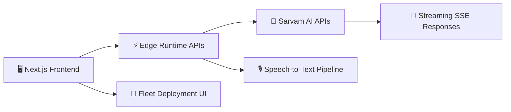

# ⚡ Sarvam Developer Portal

<div align="center">


### Enterprise AI Developer Experience Platform

<p align="center">
A modern AI-native developer portal built for conversational AI workflows, model experimentation, streaming inference, fleet deployment simulation, and enterprise-grade developer tooling.
</p>

<br/>


<br/>


</div>

---

# 🧠 Overview

Sarvam Developer Portal is a production-style AI platform experience designed around modern enterprise AI workflows.

The platform combines:

- Conversational AI streaming
- Real-time voice transcription
- AI response comparison systems
- Fleet deployment simulation
- Interactive developer documentation
- Enterprise-grade UI architecture

Built entirely with the **Next.js App Router ecosystem**, the project demonstrates how modern AI-native applications can deliver highly interactive developer tooling experiences with low-latency streaming infrastructure and scalable frontend architecture.

---

# ✨ Core Capabilities

<table>
<tr>
<td width="50%">

## ⚡ Streaming AI Playground

Real-time conversational AI interface powered by:
- Streaming completions
- Edge runtime APIs
- Incremental token rendering
- Voice + text workflows
- Custom markdown rendering

</td>
<td width="50%">

## 🎙 Voice Transcription Pipeline

Integrated speech-to-text workflows using:
- Audio recording hooks
- Multipart uploads
- Sarvam speech APIs
- Real-time transcription pipelines

</td>
</tr>

<tr>
<td width="50%">

## 🧠 AI Diff Comparison Engine

Advanced side-by-side AI response comparison system featuring:
- Semantic diff visualization
- Token-level highlighting
- Streaming response analysis
- Comparative prompt experimentation

</td>
<td width="50%">

## 🚀 Fleet Deployment Simulation

Enterprise-style model deployment dashboard supporting:
- Device fleet monitoring
- Model rollout simulation
- Status tracking
- Multi-region deployment workflows

</td>
</tr>

<tr>
<td width="50%">

## 📚 Interactive Developer Documentation

Rich documentation experience with:
- Dynamic layouts
- Interactive navigation
- Developer-focused UX
- Design-system consistency

</td>
<td width="50%">

## 🎨 Enterprise UI Architecture

Modern UI stack featuring:
- Glassmorphism-inspired design
- Dark/light theme support
- Responsive interaction systems
- Memoized rendering optimizations

</td>
</tr>
</table>

---

# 🏗 System Architecture



---

# 🧰 Technology Stack

## Frontend Platform

- Next.js 16
- React 19
- TypeScript
- Tailwind CSS v4
- Lucide React Icons

## AI Infrastructure

- Sarvam AI Chat APIs
- Streaming Completion APIs
- Speech-to-Text APIs
- Edge Runtime APIs

## Developer Experience

- App Router Architecture
- Client-side Streaming Hooks
- Audio Recording Pipelines
- Incremental Rendering Systems

## UI Engineering

- Theme Switching
- Memoized Components
- Custom Markdown Renderer
- Responsive Layout Systems

---

# ⚡ Platform Modules

---

# 🎮 AI Playground

### `/playground`

The central conversational AI workspace for interacting with streaming LLM responses.

### Features

- Real-time AI token streaming
- Voice input integration
- Custom markdown rendering
- Keyboard-first workflows
- Dark/light theme support
- Streaming lifecycle management

### Engineering Highlights

- Built with client-side streaming hooks
- Uses Edge Runtime for low-latency inference
- Implements incremental rendering pipelines
- Optimized with memoization and hydration-safe patterns

---

# 🧠 Diff Viewer

### `/diff-viewer`

A specialized AI output comparison workspace designed for prompt experimentation and model evaluation.

### Features

- Token-level semantic diffing
- Multi-output comparison
- AI response evaluation
- Prompt experimentation tooling

### Engineering Highlights

- Custom diff algorithm implementation
- Interactive visualization system
- Efficient token comparison rendering
- Optimized reconciliation workflows

---

# 🚀 Fleet Deployment Dashboard

### `/fleet-deploy`

An enterprise-inspired deployment simulation interface for managing distributed AI model rollouts.

### Features

- Fleet health monitoring
- Deployment rollout simulation
- Device status tracking
- Multi-version deployment visualization

### Engineering Highlights

- Stateful deployment workflows
- Real-time UI state transitions
- Operational dashboard architecture
- Enterprise deployment UX patterns

---

# 📚 Documentation System

### `/documentation`

Interactive developer documentation experience designed around enterprise API platforms.

### Features

- Dynamic navigation systems
- Rich UI presentation
- Developer-first information architecture
- Interactive learning experience

---

# 🔌 API Infrastructure

---

# `/api/chat`

### Streaming AI Completion API

Handles real-time conversational AI streaming using Sarvam AI.

### Features

- Streaming responses
- Edge Runtime execution
- SSE-compatible architecture
- Incremental token delivery

### Highlights

```ts
runtime = 'edge'
stream: true
```

Optimized for low-latency AI inference experiences.

---

# `/api/transcribe`

### Speech-to-Text API

Processes voice recordings using Sarvam speech recognition APIs.

### Features

- Multipart file uploads
- Audio transcription
- Browser recording integration
- Voice workflow support

---

# `/api/compare`

### AI Comparison Engine

Runs multi-output generation pipelines for comparative AI experimentation.

### Features

- Multi-response generation
- Timeout handling
- Stream aggregation
- AI output reconciliation

---

# 🧠 Engineering Highlights

## ⚡ Edge-Native Architecture

The platform heavily leverages the Next.js Edge Runtime for ultra-low-latency AI interactions.

## 🧩 Streaming-First Design

Core user experiences are built around:
- Incremental token rendering
- Streaming lifecycle management
- Real-time UX feedback loops

## 🎙 Multimodal AI Workflows

Combines:
- Conversational AI
- Voice interfaces
- AI comparison systems
- Interactive deployment tooling

## 🏢 Enterprise UX Patterns

The UI architecture mirrors modern enterprise AI tooling platforms with:
- Dashboard-centric navigation
- Operational visibility
- Structured workflows
- Contextual interactions

---

# 📁 Project Structure

```bash
sarvam-developer-portal/
│
├── app/
│   ├── api/
│   │   ├── chat/
│   │   ├── compare/
│   │   └── transcribe/
│   │
│   ├── playground/
│   ├── diff-viewer/
│   ├── documentation/
│   ├── fleet-deploy/
│   │
│   ├── hooks/
│   └── utils/
│
├── components/
│
├── public/
│
├── package.json
└── README.md
```

---

# 🚀 Quickstart

## 1️⃣ Clone Repository

```bash
git clone <your-repo-url>

cd sarvam-developer-portal
```

---

# 2️⃣ Install Dependencies

```bash
npm install
```

---

# 3️⃣ Configure Environment Variables

Create a `.env.local` file:

```env
SARVAM_API_KEY=your_api_key_here
```

---

# 4️⃣ Start Development Server

```bash
npm run dev
```

Application runs at:

```bash
http://localhost:3004
```

---

# 📊 Architectural Concepts Demonstrated

```diff
+ Streaming AI Interfaces
+ Edge Runtime APIs
+ Voice AI Workflows
+ Real-Time Rendering
+ Enterprise Dashboard UX
+ AI Comparison Infrastructure
+ Client-Side Streaming Hooks
+ Token-Level Diff Systems
+ Operational Deployment Simulation
```

---

# 🧪 Engineering Focus Areas

<table>
<tr>
<td width="50%">

### Frontend Systems
- Streaming interfaces
- Hydration-safe rendering
- Client state management
- UI performance optimization

</td>
<td width="50%">

### AI Infrastructure
- LLM integrations
- Streaming APIs
- Voice AI systems
- Prompt experimentation

</td>
</tr>

<tr>
<td width="50%">

### Platform Engineering
- Edge execution
- Deployment simulation
- Operational tooling
- API orchestration

</td>
<td width="50%">

### UX Engineering
- Enterprise workflows
- Dashboard architectures
- Interaction systems
- Developer experience

</td>
</tr>
</table>

---

# 🌌 Vision

Sarvam Developer Portal explores the future of AI-native developer platforms by combining conversational interfaces, multimodal workflows, and operational tooling into a unified enterprise-grade experience.

The project demonstrates how modern AI systems can move beyond simple chat interfaces into full-scale interactive developer ecosystems.

---

# 🤝 Contributing

```bash
# Fork the repository

# Create feature branch
git checkout -b feature/amazing-feature

# Commit changes
git commit -m "Add amazing feature"

# Push branch
git push origin feature/amazing-feature
```

---

# ⭐ Final Note

If you found this project interesting, consider giving it a ⭐ on GitHub.

<div align="center">

### ⚡ Built for the Future of AI Developer Infrastructure


</div>
